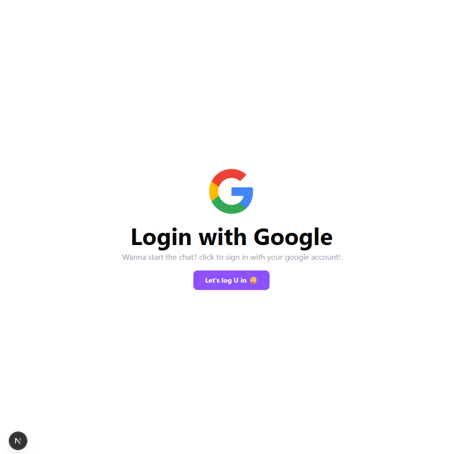
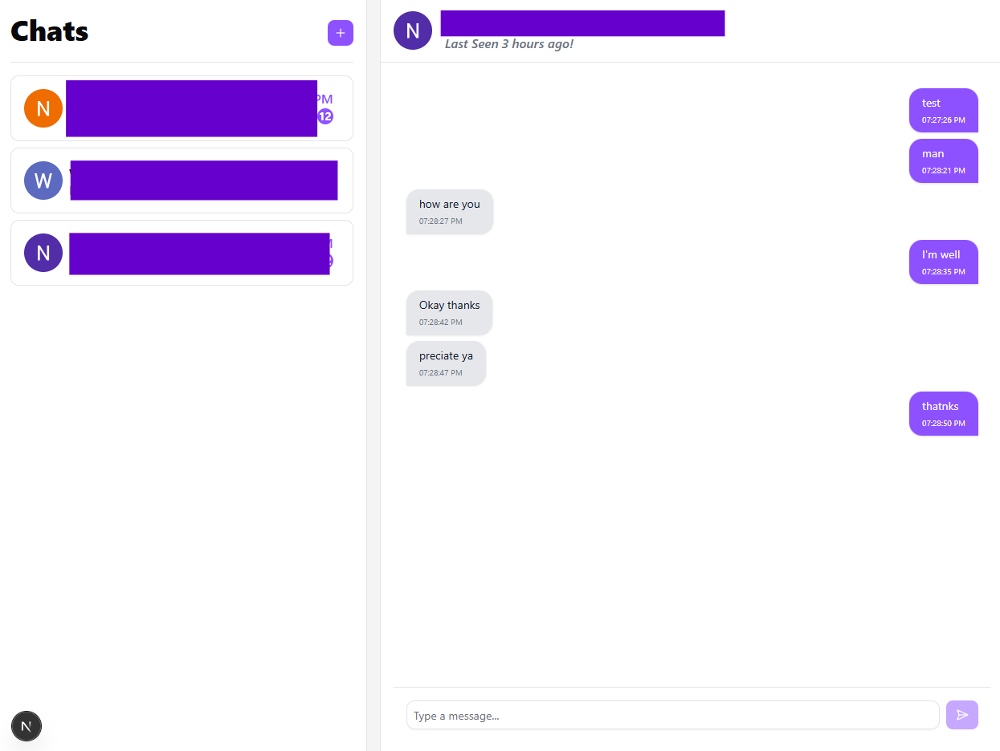
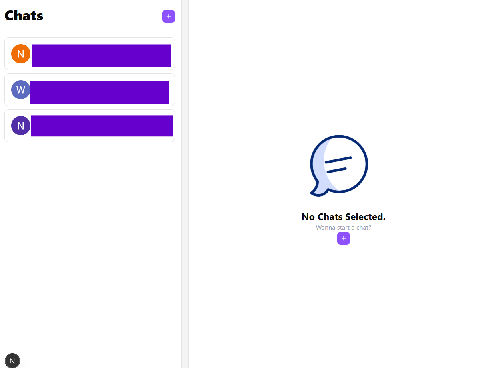

# Teams Clone

A simple email-style chat platform inspired by Microsoft Teams.

## Overview

This project is a chat application that allows users to communicate through email-based messaging.  
Authentication is handled using **Google OAuth** for secure and seamless sign-in.

## Tech Stack

### Frontend
- Next.js

### Backend
- Java
- Spring Boot

## Features

- Google OAuth authentication
- Email-style chat interface
- Secure frontend–backend communication
- Scalable backend architecture

## Project Structure

- `frontend/` – Next.js application
- `backend/` – Spring Boot REST API

## Getting Started

### Prerequisites
- Node.js
- Java 17+
- Google OAuth credentials

### Run Frontend
```bash
cd frontend
npm install
npm run dev
```
## Screenshots

### Login with Google


### Chat Conversation


### Chat Dashboard


